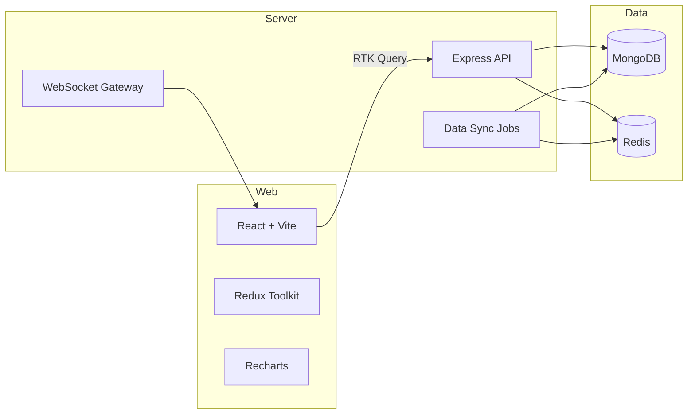

# f1-stats-suite

A production-grade Formula 1 statistics platform scaffold featuring a pnpm + Turborepo monorepo, MongoDB data sync jobs, and a Tailwind-powered React front-end with live telemetry simulation.

## Architecture



## Repository Layout

- `apps/server` — Express API, Mongoose models, sync jobs, and WebSocket gateway.
- `apps/web` — React SPA with Redux Toolkit, RTK Query, i18n, and charts.
- `packages/types` — Shared Zod schemas and DTOs.
- `packages/ui` — shadcn/ui-inspired primitives shared across the monorepo.
- `packages/config` — ESLint, Prettier, and Tailwind configuration packages.
- `docs/` — API reference, ERD diagram, adapter guide, and i18n quickstart.

## Getting Started

```bash
pnpm install
pnpm dev
```

The above command bootstraps both the web and server applications via Turborepo.

### Environment Variables

Create `.env` files for the server and web apps:

```
# apps/server/.env
MONGO_URI=mongodb://localhost:27017/f1_stats_suite
JWT_SECRET=dev-secret
REDIS_URL=redis://localhost:6379
PORT=8080
CORS_ORIGINS=http://localhost:5173
SIMULATE_LIVE=true
```

```
# apps/web/.env
VITE_API_BASE_URL=http://localhost:8080
VITE_WS_URL=ws://localhost:8080/live
VITE_DEFAULT_LOCALE=en
```

### Development Scripts

| Command | Description |
| --- | --- |
| `pnpm dev` | Run server and web dev servers concurrently. |
| `pnpm lint` | Lint all packages using shared ESLint config. |
| `pnpm test` | Run Jest (server) and Vitest (web) suites. |
| `pnpm typecheck` | Execute TypeScript project references. |
| `pnpm format` | Format sources with Prettier. |

### Testing & Quality Gates

- Backend: Jest + Supertest (see `apps/server/tests`).
- Frontend: Vitest + React Testing Library plus Playwright smoke placeholders.
- Husky + lint-staged guard staged files pre-commit.

### Data Sync Overview

Adapters (`ErgastAdapter`, `OpenF1Adapter`, `CsvAdapter`) power a daily cron job (`apps/server/src/jobs/sync.ts`) that upserts seasons, drivers, and races into MongoDB using idempotent keys. Redis caches expensive aggregates for analytics queries.

### Screenshots

_Add screenshots of the dashboard and driver compare views once available._

## Deployment

- Server containerized via `apps/server/Dockerfile` (Render/Railway ready).
- Web bundled as static assets via `apps/web/Dockerfile` (Netlify/Vercel friendly).
- `docker-compose.yml` orchestrates local MongoDB, Redis, server, and web instances.

## Acceptance Criteria Snapshot

- Auth endpoints with JWT + argon2 hashing.
- Sync job seeds demo seasons (2021-2023) from CSV + remote adapters.
- Web app exposes dashboard, drivers list & detail, and live telemetry pages with RTL toggle.
- Tests & lint/typecheck wired via Turborepo pipelines.
